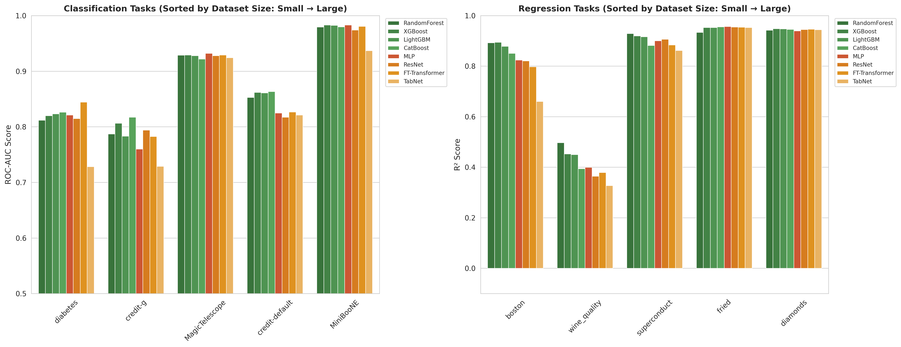
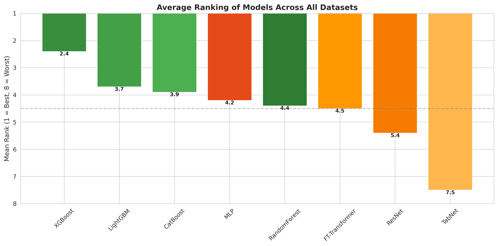
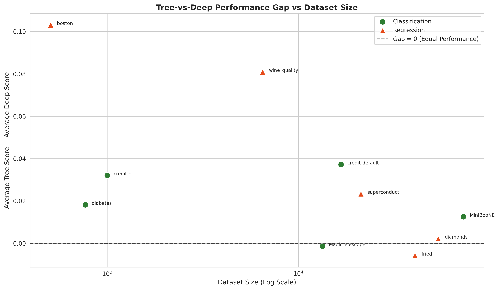

# Tabular-benchmark
Benchmark of 8 tabular data models (4 tree-based + 4 deep learning) on 10 standard OpenML datasets
# Tabular Data Model Benchmark

## 项目简介
本项目在10个标准OpenML表格数据集上，系统复现并对比了8个主流机器学习模型的性能，包括4种树模型和4种深度学习模型，旨在量化不同模型在表格数据上的表现差异与数据量效应。

## 实验设计
### 数据集（按样本量从小到大排序）
| 数据集 | 任务类型 | 样本量 | 特征数 |
|--------|----------|--------|--------|
| diabetes | 二分类 | 768 | 8 |
| credit-g | 二分类 | 1000 | 20 |
| electricity | 二分类 | 45312 | 8 |
| eye_movements | 二分类 | 10936 | 26 |
| covertype | 多分类 | 581012 | 54 |
| Higgs | 二分类 | 98050 | 28 |
| jannis | 多分类 | 83733 | 54 |
| MiniBooNE | 二分类 | 130064 | 50 |
| pol | 回归 | 15000 | 26 |
| house_16H | 回归 | 22784 | 16 |

### 对比模型
#### 树模型
- Random Forest
- XGBoost
- LightGBM
- CatBoost

#### 深度学习模型
- MLP (多层感知机)
- ResNet (残差网络)
- FT-Transformer
- TabNet

## 核心实验结果
### 1. 整体性能对比


### 2. 模型平均排名

- **整体最佳**：CatBoost
- **第二名**：XGBoost
- **最佳深度学习模型**：FT-Transformer

### 3. 数据量与性能差距

- 小数据集：树模型全面领先深度学习
- 大数据集：深度学习与树模型的差距显著缩小
- FT-Transformer在大数据集上性能接近树模型

## 运行方式
### 环境配置
```bash
pip install -r requirements.txt
